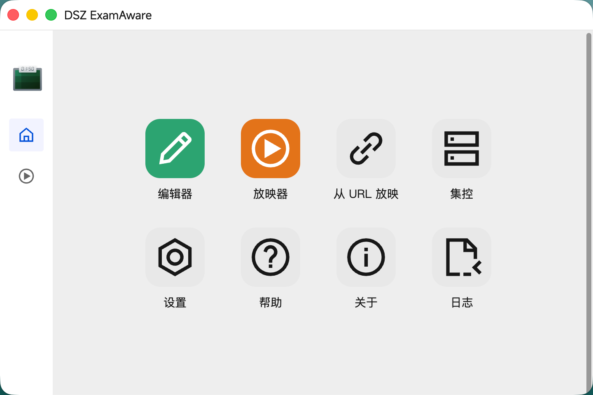
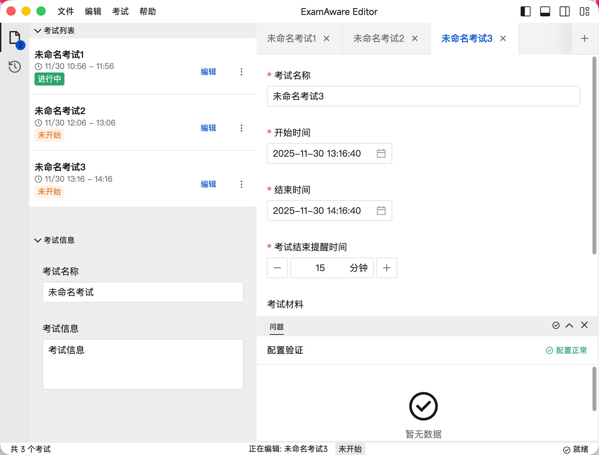

# ExamAware2 知试

一款易用、跨平台的大屏考试信息展示工具.






## 启动开发模式

```bash
pnpm i
pnpm dev
```

或：

```bash
pnpm web:dev
```

## 集控服务开发

集控服务的 PostgreSQL 开发库由根目录的 `compose.yml` 管理。数据库端口、用户名、密码和库名与控制服务的开发默认值一致，无需额外配置。

```bash
# 首次启动或恢复开发数据库；命名卷会保留数据
pnpm control:db:up

# 应用数据库迁移
pnpm control:db:migrate

# 启动集控服务
pnpm control:dev
```

首次部署空数据库时，构建服务并创建首位管理员：

```bash
pnpm control:build
CONTROL_ADMIN_EMAIL=admin@example.edu \
CONTROL_ADMIN_NAME="School administrator" \
CONTROL_ADMIN_PASSWORD="replace-with-a-strong-password" \
pnpm control:bootstrap-admin
```

停止数据库但保留数据：

```bash
pnpm control:db:down
```

## 用户讨论社区

QQ 群： 901670561

智教联盟论坛板块：[ExamAware 板块](https://forum.smart-teach.cn/t/examaware)
