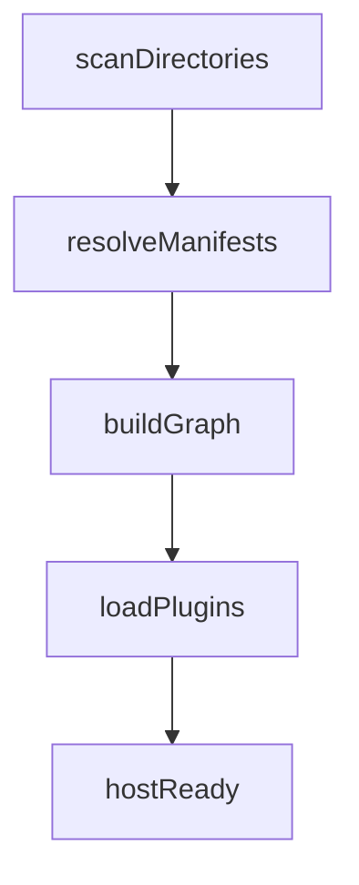

# ExamAware Desktop 插件系统规划

> 参考 Koishi / Cordis 的可逆插件体系与 ClassIsland 插件 SDK 经验，结合当前 Desktop API 封装成果，设计面向主进程 + 渲染进程的统一插件模型。

## 目标与约束

- **插件形态**：插件是独立发布的 npm 包，包含 `package.json` 与 `examaware` 清单，支持在桌面端动态加载，既可增量修改主进程逻辑，也可扩展渲染层（如播放器、设置页、托盘菜单等）。
- **双进程支持**：一个插件可以选择实现 `main`（Electron 主进程）与 `renderer`（Vue 应用）两个入口；默认提供共享的 `PluginContext` 能力，内部包含 `ctx.effect()`、`ctx.settings`、`ctx.desktopApi` 等可逆 API。
- **路径无关（可逆性）**：多次加载 / 卸载后的最终行为只与最终启用的插件集合有关。
  - 不泄露内存：所有副作用必须注册 disposer，卸载后回收。
  - 无残留影响：插件 A 卸载后，其对其他插件提供的服务、全局状态全部撤销。
  - 依赖驱动生命周期：存在依赖关系时，自动拓扑排序，确保 `provider` 在 `consumer` 之前加载，卸载顺序反向执行。
- **热插拔体验**：运行时可加载、卸载、重载插件，便于开发调试；插件管理页位于设置页，具备启用、禁用、配置、安装（本地路径 / 市场）能力。
- **现代化开发体验**：提供 Vite + TS 模板（`create-examaware-plugin`），内置调试脚本（热更新、自动将构建产物放入桌面端插件目录），并能复用 player 包类型定义。

## 核心设计

### 1. 插件清单 & 包结构

```jsonc
{
  "name": "@examaware/plugin-example",
  "version": "1.0.0",
  "main": "dist/node.cjs",
  "module": "dist/node.mjs",
  "examaware": {
    "displayName": "Example 插件",
    "description": "向播放器注入提醒",
    "targets": {
      "main": "src/main.ts",
      "renderer": "src/renderer.ts"
    },
    "dependencies": ["@examaware/plugin-time-sync"],
    "services": {
      "provide": ["reminder"],
      "inject": ["ntp"]
    },
    "settings": {
      "schema": "./schema.json"
    }
  }
}
```

- `targets`：声明入口文件；构建时分别产出适配 `main` / `renderer` 的 bundle（ESM）。
- `services`：显式定义提供 / 依赖的服务名，供宿主完成拓扑排序与生命周期管理。
- `settings.schema`：指向 JSON Schema，供设置页动态生成表单（或通过自定义 Vue 组件）。

### 2. 插件上下文（PluginContext）

```ts
interface PluginContext {
  app: 'main' | 'renderer'
  logger: Logger
  effect(fn: () => void | Promise<void>): void
  settings: {
    all(): Record<string, any>
    get<T>(key: string, def?: T): T
    set<T>(key: string, value: T): Promise<void>
    patch(partial: Record<string, any>): Promise<void>
    reset(): Promise<void>
    onChange(listener: (config: Record<string, any>) => void): Disposable
  }
  desktopApi: DesktopAPI // renderer 可用，main 端提供轻量代理
  services: {
    provide<T>(name: string, value: T): Disposable
    inject<T>(name: string): T
    when<T>(name: string, cb: (svc: T, owner: string) => void | (() => void))
  }
  ipc: {
    registerChannel(name: string, handler: IPCHandler): Disposable
    invoke(name: string, ...args: any[]): Promise<any>
  }
  ui: {
    addSettingPage(opts: SettingPageMeta): Disposable
    addPlayerToolbar(item: ToolbarItem): Disposable
    registerComponent(ns: string, component: Component): Disposable
  }
}
```

- `effect` / `Disposable` 遵循 Cordis 的可逆性：注册即返回 `dispose()`，卸载插件时自动调用。
- `services`：实现 Koishi 风格的 service graph，自动推导依赖顺序；`provide` 必须在 `init` 阶段调用。
- `ui`：面向渲染层的扩展点全部通过注册 API 返回 disposer，确保路径无关。

### 3. 生命周期

1. **扫描**：宿主（主进程）在启动时读取 `plugins/` 目录（用户数据目录内）以及内置插件列表，解析 `package.json` + `examaware` 字段。
2. **依赖解析**：构建服务图，执行拓扑排序；若检测到循环依赖或缺失的 `provide`，在设置页展示错误并阻止加载。
3. **加载**：
   - 主进程入口：通过 `vm` / `import()` 加载 ESM bundle，提供 `PluginContext`，调用 `export default (ctx, config)`。
   - 渲染入口：借助 Desktop API 的 plugin registry（当前已有雏形），在 Vue app ready 后动态 import 插件 bundle，注入 `ctx`。
4. **配置**：`ctx.settings` 读取 / 写入 plugin namespace 下的配置，默认 `examaware.settings.namespace = packageName`。
5. **卸载**：调用插件返回的 disposer 或 `ctx.effect` 收集的所有副作用，逆拓扑顺序执行，保证路径无关。

### 4. 插件包的构建 & 开发

- 提供 `@examaware/plugin-sdk`：导出 `defineExamAwarePlugin()` helper、类型声明、`PluginContext` 接口、热重载 helper。
- CLI：`pnpm create examaware-plugin`
  - 基于 Vite library 模式，默认输出 `dist/main.js`、`dist/renderer.js`。
  - Dev 命令 `pnpm dev --watch --target=renderer`：通过 WebSocket 通知桌面端热重载。
- 插件可以依赖 `@dsz-examaware/player` 类型、`@examaware/core` 工具。

### 5. 插件管理 UI（设置页）

- 新增 `Settings > 插件`，展示：
  - 安装列表（启用、禁用、版本、依赖状态、服务提供情况）。
  - “安装插件”按钮：支持拖拽本地 `tgz` / 目录、未来接入插件市场。
  - 每个插件入口包含“配置”“重载”“卸载”“查看日志”。
- 与主进程通信：`renderer` 页面通过 IPC 请求主进程执行安装 / 卸载 / 重载。
- 需要 Loading 状态 & 错误提示；记录操作日志（便于 debug）。

### 6. 安全与隔离

- 插件 bundle 在受限上下文运行，默认禁止 Node 原生模块；主进程入口可 opt-in 访问 `electron` API，但必须通过显式白名单。
- 通过 `import { safeRequire } from '@examaware/plugin-sdk' }` 受控加载依赖。
- 插件访问文件系统需通过 `ctx.services.provide('fs-permissions', ...)` 或主程序暴露的 service。

## Roadmap & TODO

| 阶段      | 内容             | 说明                                                                                        | 状态      |
| --------- | ---------------- | ------------------------------------------------------------------------------------------- | --------- |
| Phase 0   | 设计确认         | 当前文档，落地可逆原则、上下文 API、依赖图。                                                | ✅ 完成   |
| Phase 1   | 插件宿主核心     | `plugin-manager`（主进程）+ `renderer` registry，解析 manifest、拓扑排序、加载 & disposer。 | ⏳ 进行中 |
| Phase 2   | Desktop API 扩展 | 补齐 `ctx.services`、`ctx.effect`、`ui/editor` 扩展点，与现有 `desktopApi.plugins` 打通。   | ⏳ 进行中 |
| Phase 3   | 插件管理 UI      | 设置页卡片、启用/禁用/日志区域、依赖错误提示。                                              | ⏳ 计划中 |
| Phase 4   | 开发者工具       | `@examaware/plugin-sdk`、脚手架、Vite 模板、热重载通道。                                    | ⏳ 计划中 |
| Phase 4.5 | 插件 SDK & DI    | 参考 Microsoft.Extensions.Hosting，提供 HostBuilder、ServiceCollection、脚手架。            | ⏳ 进行中 |
| Phase 5   | 样例插件 & 文档  | 官方示例：主题切换、考场提醒；对外发布开发指南。                                            | ⏳ 计划中 |

### Implementation TODO（可在 PR 中复用）

- [x] `packages/desktop/src/main/plugin/`：实现 `PluginHost`（扫描、依赖图、load/unload、IPC 管道，含服务快照广播）。
- [x] `packages/desktop/src/renderer/src/runtime/desktopPluginHost.ts`：renderer 侧 loader + `PluginContext` 实例化，并支持按需动态导入 renderer 入口。
- [x] 扩展 `desktopApi.plugins`：支持 manifest 元数据、依赖检查、状态查询，以及 `desktopApi.ui.settings.registerPage` 等 UI 扩展能力。
- [x] `settings` 页面新增“插件” tab + 组件库（列表、详情、配置）。
- [x] `desktopApi.editor.*`：允许 renderer 插件注册面板、接管 Editor 中央视图并注入脚本。
- [x] CLI：`packages/plugin-sdk/bin/create-examaware-plugin.mjs` 输出 TS + Vite 架构，默认同时构建 main/renderer 并演示 Vue SFC 设置页。
- [ ] 文档：开发指南、API 参考、热重载说明（当前文档已追踪阶段性进展，仍需完善开发者指南）。
- [x] `@examaware/plugin-sdk`：导出 `defineExamAwarePlugin()`、`createPluginHostBuilder()`、`ServiceCollection` 等工具，提供 npm 发布物与类型声明。
- [x] 插件脚手架：支持一键初始化（`pnpm create examaware-plugin`），默认引入 SDK 并示范 DI。
- [x] Hosting API 对齐：在 `packages/desktop/src/main/plugin/hosting/` 内实现与 `Microsoft.Extensions.Hosting` 相仿的 Builder / Host / Lifetime，并统一被 SDK 复用。
- [x] CLI 模板解耦：模板已存放于 `packages/plugin-sdk/templates/`，覆盖 package/tsconfig/vite/SFC，CLI 渲染时按需生成。

> Phase 2 已完成 renderer 端 Plugin Host、`ctx.desktopApi` 暴露与 Settings UI 扩展 API；下一步聚焦 `.ea2x` 安装与 CLI/SDK。

> 需要按阶段推进：先落地主进程插件宿主 & Renderer API，再逐步引入 UI 与脚手架。每个阶段完成后更新此文档中的表格 / TODO，以便追踪。

## Phase 4.5 规划：插件 SDK 与依赖注入

目标：提供可发布至 npm 的官方 SDK，借鉴 `Microsoft.Extensions.Hosting` / `Microsoft.Extensions.DependencyInjection` 的 HostBuilder + ServiceCollection 模式，帮助插件开发者快速装配依赖、注册后台任务并输出标准入口。

### 设计要点

- **HostBuilder**：`createPluginHostBuilder(ctx)` 暴露 `configureServices(configureFn)`、`configure(ctx => {})`、`build()` API。`build()` 返回 `PluginHostApplication`，其 `run()` 将调用插件主体逻辑并返回 disposer。
- **ServiceCollection**：支持 `addSingleton` / `addScoped` / `addTransient` 与 `tryAdd*` 系列，底层复用 `ctx.services` 并自动转换为 ExamAware 的 `provide` / `inject` 语义；允许插件在 renderer 与 main 端共享契约类型。
- **ServiceProvider**：针对插件内部依赖提供延迟解析（`get<T>(token)`）、作用域（scope）与 `useScope()` helper，落地简化版容器。
- **Hosted Services**：提供 `addHostedService(MyBackgroundTask)`，在 `run()` 时依次启动，插件卸载时自动 `dispose()`，以此对齐 `IHostedService` 模式。
- **配置桥**：`builder.configureSettings((settings) => ...)` 封装 `ctx.settings` 读写，允许在构建期注入默认配置 / schema。
- **脚手架**：`pnpm create examaware-plugin` 默认引入 SDK，生成示例 `hostBuilder` 代码与测试。
- **Typing**：SDK 发布 `@types/examaware-plugin-sdk`，或在包内捆绑 d.ts，覆盖 `PluginRuntimeContext`、`ServiceDescriptor`、`HostBuilderOptions` 等类型。

### 代码归属与 API 对齐计划（与 Microsoft.Extensions.Hosting 接轨）

- **代码归位**：所有 Hosting / DI 核心统一放入 `packages/desktop/src/main/plugin/hosting/`，Desktop 主体与 SDK 共用同一实现，SDK 仅作为薄封装导出。
- **HostBuilder API**：提供 `ExamAwareHostBuilder` / `HostBuilderContext` / `HostBuilderSettings`，方法命名与 `.NET` 靠拢（`configureServices`、`build()`、`run()`），并提供 `Host` 实例以便插件在需要时手动 `start()/stop()`。
- **HostedService 生命周期**：对齐 `IHostedService`，在 `Host.start()` -> `HostedService.start()` -> `Host.stop()` -> `HostedService.stop()` 顺序执行，并保留 `HostApplicationLifetime` 钩子位（预留 `onStarted/onStopping`）。
- **Middleware 管线**：保留 `use()` 能力，但实现形态调整为 `HostPipeline`，其签名与 Kestrel 中 `IApplicationBuilder` 类似，方便扩展。
- **配置上下文**：`HostBuilderContext` 暴露 `environmentName`、`properties`（`Map`），供 CLI / 插件读取环境；未来扩展 `configureHostConfiguration()`、`configureAppConfiguration()`。
- **导出策略**：`@examaware/plugin-sdk` 通过 `exports['.']` 暴露 `defineExamAwarePlugin`、`createHostBuilder`、`ServiceCollection` 等，示例插件改用新的别名，文档同步更新。

### 里程碑

1. **SDK 包**：在 `packages/plugin-sdk/` 新建 npm 包，输出 ESM + d.ts，确保可以被示例插件引用。
2. **依赖注入内核**：实现 `ServiceCollection`、`ServiceDescriptor`、`ServiceLifetime`、`ServiceProvider`，并编写 100% 覆盖的单元测试（参考 Microsoft Extensions 的行为）。
3. **HostBuilder**：实现 `createPluginHostBuilder(ctx)` + `PluginApplication`，支撑 `configureServices`、`use()` 中间件链、`addHostedService`。
4. **CLI 脚手架**：扩展创建脚本，生成示例插件（含 renderer/main 入口、SDK 使用示例、测试）。
5. **文档 & 指南**：在本计划与 README 中补充 SDK 使用说明、DI 模式、HostedService 生命周期；在 Phase 表格中实时更新状态。

> 实施顺序：先完成 SDK 包与 DI 核心，再更新示例插件 / CLI。每当完成一个里程碑，立即在“Roadmap & TODO”及“Implementation TODO”打勾以保持同步。

### 当前进展（2025-12-21）

- Hosting / DI 内核全部托管在 `packages/desktop/src/main/plugin/hosting/`，SDK 层仅做 re-export，`HostApplicationLifetime`、`ServiceCollection`、`ExamAwareHostBuilder` 保持与 Desktop 相同实现。
- `create-examaware-plugin` CLI 现已使用模板目录输出 TS + Vite 架构，包含 `vite.config.ts`（renderer + Vue SFC）、`vite.main.config.ts`、`tsconfig.node.json`、`env.d.ts` 与默认设置页组件。
- 模板默认拉取 `@vitejs/plugin-vue`、`vue-tsc`、`@types/node` 等依赖，脚本提供 `dev`（双进程 watch）、`build:types`（`vue-tsc --emitDeclarationOnly`）与 `lint`（`vue-tsc --noEmit`）。
- 示例插件 `@examaware/plugin-hello-world` 已对齐该结构，沿用 Vite 构建 main/renderer、启用 Vue SFC，并通过 `build:types` 产出声明文件以匹配 manifest `types` 字段。

## Phase 1 详细方案：插件宿主核心

目标：在 Electron 主进程实现可逆的 `PluginHost`，负责扫描、解析 manifest、构建依赖图、加载 / 卸载 / 重载插件，并通过 IPC 将状态同步给渲染层。该阶段产物为可运行的宿主骨架 + renderer 侧 minimal registry，确保后续阶段只需在此基础上迭代。

### 目录与模块划分

- `src/main/plugin/`：主进程插件系统根目录。
  - `manifest.ts`：定义 `ExamAwarePluginManifest`、`ExamAwarePluginPackage`、解析 & 校验逻辑（使用 `zod` 或简易校验器）。
  - `graph.ts`：依赖关系建模（服务 provide/inject + package 依赖），负责拓扑排序 / 检测循环。
  - `host.ts`：`PluginHost` 类，实现 `scan() -> load() -> unload()` 等 API，内部维护状态机。
  - `loader.ts`：封装 `import()` / `vm` 执行环境，暴露 `loadEntry(manifest, target)` 并注入 `PluginContext`。
  - `ipc.ts`：主进程 <-> 渲染层通道，提供 `plugin:list`, `plugin:toggle`, `plugin:reload`, `plugin:get-log` 等 handler。
- `src/renderer/src/runtime/desktopPluginHost.ts`：渲染层 minimal adapter，调用现有 `desktopApi.plugins`，透传 IPC 调用，并提供列表状态给设置页。

### Manifest 解析

1. 从 `package.json` 读取 `examaware` 字段，合并默认值：
   - `root`: 插件所在目录（用户插件目录 / 内置目录）。
   - `enabled`: 来自用户配置（`plugins.json`）的覆盖值。
   - `targets.main/renderer`: 若缺失则忽略对应入口。
2. 校验字段：
   - `name`、`version` 必须存在；`displayName`、`description` 为可选。
   - `services.provide`、`services.inject` 需为字符串数组；自动去重。
   - `dependencies`：记录其他包名，供安装提示；与服务依赖不同。
3. 生成 `ResolvedManifest`：包含绝对路径、入口类型（CJS/ESM）、最后修改时间、签名 hash（后续做缓存）。

### 依赖与拓扑排序

- 数据模型：
  - `PluginNode`: { name, provides: string[], injects: string[], deps: string[] }
  - `ServiceEdges`: 当 `A` provide `svc` 且 `B` inject `svc` 时，建立 `A -> B` 依赖。
  - `PackageDeps`: manifest `dependencies`（软依赖），用于提示但不阻塞加载。
- 算法：
  1. 构建服务映射（一个 service 允许多个 provider？默认单 provider，冲突时报错）。
  2. 根据服务依赖 + `requiredBefore`（若 manifest 未来扩展）生成 DAG。
  3. 对 DAG 执行拓扑排序（Kahn 算法）；若检测到环，记录详细链路并标记插件为 `error: cycle`。
  4. 加载顺序：拓扑输出顺序；卸载顺序：拓扑逆序。

### PluginHost 生命周期



- **scanDirectories()**：读取 `paths = [app.getPath('userData')/plugins, resources/plugins]`，支持 symlink。
- **resolveManifests()**：调用 `manifest.ts` 解析 + 缓存。
- **buildGraph()**：依赖排序 + 状态（`idle/loading/active/error`）。
- **loadPlugins()**：按顺序执行 `loader.loadEntry(manifest, 'main')`，捕获 disposer。
- **unloadPlugin(name)**：调用 disposer，更新状态，若 fail 则记入 `host.errors`。
- **reloadPlugin(name)**：`await unload -> load`，同时通知 renderer。

### 偏好存储与状态持久化

- 使用 `FilePluginPreferenceStore` 将启用状态与插件配置持久化到用户数据目录，例如：`{userData}/plugins/plugins.json`。
- `PluginHost` 在 `scan()` 时读取偏好以覆盖 manifest 中的默认 `enabled`；状态变化（启用 / 禁用 / 配置）即时写回。
- store 提供同步读取（保证启动时无需等待 I/O），并对写入操作进行幂等处理与临时文件落盘，避免崩溃导致数据损坏。
- 未来可在 Phase3 UI 中共用该存储，实现设置页切换后即时反映主进程状态。

### PluginContext（主进程版）

```ts
interface MainPluginContext {
  app: 'main'
  logger: ScopedLogger
  config: Record<string, any>
  effect(disposer: () => void): void
  services: ServiceManager
  ipc: {
    registerChannel(name: string, handler: IpcMainInvokeHandler): Disposable
    send(channel: string, payload: any): void
  }
  windows: {
    broadcast(channel: string, payload: any): void
    find(name: string): BrowserWindow | undefined
  }
}
```

- `effect` 将 disposer 收集进 `DisposerGroup`；`PluginHost` 在卸载时统一回收。
- `services` 允许插件提供主进程能力（例如额外的 IPC handler）；renderer 插件可以通过 IPC 获取这些服务。

### IPC 通道

- `plugin:list`：renderer 请求当前插件状态（name、displayName、version、status、errors、provides、injects）。
- `plugin:toggle`：启用/禁用插件，更新用户配置，触发 load/unload。
- `plugin:reload`：热重载（常用于开发）。
- `plugin:install`：后续阶段提供；预留 handler。
- 所有通道需返回结构 `{ ok: boolean, data?, error? }`，方便设置页展示。

### 日志与可观测性

- `PluginHost` 内部使用 `ScopedLogger('plugin:<name>')`。
- 维护 `host.state.logTail[name]`（最近 N 条），用于设置页「查看日志」。
- 错误分类：`manifest-error`、`dependency-missing`、`load-failed`、`runtime-error`。

### Phase1 完成标准

1. 主进程可在启动时扫描并加载内置样例插件（可为 stub）。
2. 支持通过 IPC 查询插件列表、启用/禁用、重载。
3. 依赖图 + 拓扑排序可检测冲突并阻止加载，错误信息可在控制台查看。
4. Renderer 侧能消费列表数据（即使 UI 未完成），为 Phase3 UI 奠定基础。
5. 所有插件副作用可通过 `effect` / disposer 回收，确保路径无关。

### Phase1 → Phase2 接口契约

- Renderer 需通过 IPC 获得插件元数据、启用状态、错误信息；Phase2 将把这些数据注入 `desktopApi.plugins`。
- 主进程 `PluginHost` 对 `services.provide/inject` 的管理将暴露为只读快照，Phase2 会在 Desktop API 中提供查询 / 订阅接口。
- 预留 `plugin:list/toggle/reload` IPC 通道；Phase2 会在 `useDesktopApi()` 中封装对应的调用与响应式状态管理。
- 插件配置（pref store）将在 Phase2 扩展为 renderer 可读写的 setting refs，确保 UI 操作与主进程偏好保持一致。

## Phase 2 预研：Desktop API 扩展

目标：将主进程 `PluginHost` 能力通过 Desktop API 安全暴露给渲染进程与插件，使其拥有服务注入、UI 扩展、配置访问能力，同时保持可逆性。

### 核心任务

- **API 设计**：
  - `desktopApi.plugins.list(): Ref<PluginListItem[]>`
  - `desktopApi.plugins.toggle(name: string, enabled: boolean)`
  - `desktopApi.plugins.reload(name: string)`
  - `desktopApi.plugins.onStateChanged(cb)`：订阅 IPC 推送，实现响应式刷新。
- **服务查询**：提供 `desktopApi.services.has(name)`、`desktopApi.services.inject<T>(name)`（只读代理）。
- **配置桥接**：对接偏好存储，将主进程的插件配置映射为 renderer 侧的 `useSettingRef(namespace)`。
- **错误 / 日志分发**：建立 `plugin:log` 推送通道，在 Desktop API 层归档最近日志供 UI 显示。

### Editor 扩展点与布局（2025Q1 更新）

Editor 中央区域将完全转向 VS Code 风格的“多容器 + 多标签”布局，底层以 [`vue-code-layout`](https://github.com/tnfe/vue-code-layout) 作为布局引擎：

- **容器（Container）**：对应 VS Code 中的左/右侧边栏、底部面板、中心编辑区。容器内可包含多个视图组（TabGroup）。
- **视图组（TabGroup）**：一组可拖拽、可拆分的标签页；插件可以选择接入现有组，或注册新的组（例如“插件调试控制台”）。
- **视图（View）**：实际渲染的 Vue 组件，支持 keep-alive、懒加载与分屏。`vue-code-layout` 的 `ViewDescriptor` 与 `LayoutManager` 将暴露给插件，方便其复用拖拽 / 快捷键行为。

在此布局之上扩展 `desktopApi.editor` 契约：

- `editor.registerContainer(meta)`：允许插件声明新的容器（如“插件工作台”）。`meta` 包含 `id`、`title`、`placement`（left/right/bottom/center）、`initialSize` 等。容器通过 `layoutManager.addContainer()` 注入，卸载时自动移除。
- `editor.registerView(meta)`：向指定容器或视图组注册一个可多开 tab 的视图。`meta` 包含 `id`、`title`、`icon`、`groupId`、`component`、`canSplit` 等设置，底层调用 `layoutManager.registerViewDescriptor()`。
- `editor.presentView(opts)`：通过 `layoutManager.presentView()` 将视图激活或新开 tab。支持 `mode: 'single' | 'multiple'` 与 `params` 以区分同一视图的不同实例（例如按文件 ID 打开多个 tab）。
- `editor.clearView(filter?)`：关闭特定 tab 或整个视图组，`filter` 可为视图 id、实例参数或 group id。
- `editor.injectScript(effect)`：在布局 ready 时获得 `{ layoutManager, codeLayout }`，可在 effect 中直接使用 `vue-code-layout` API（例如注册拖拽守卫、同步布局配置）。

### Editor 菜单 API

为对齐 VS Code 的命令面板 / 右键菜单体验，新增 `editor.menus` 命名空间：

- `editor.menus.register(menuId, factory)`：`menuId` 支持预设值（`'commandPalette' | 'tab/context' | 'panel/context' | 'menubar/file' ...`）或自定义命名空间。`factory` 接收 `{ ctx, layoutManager, activeView }`，返回菜单项数组（含分组、快捷键、可见性条件）。
- `editor.menus.update(menuId, updater)`：动态变更菜单项（例如根据选中文件类型切换）。
- `editor.menus.dispose(menuId)`：撤销插件注册的菜单；插件卸载时自动触发。

菜单项结构：

```ts
interface EditorMenuItem {
  id: string
  label: string
  icon?: string
  when?: string // VS Code 风格表达式，layoutManager 会提供上下文
  order?: number
  shortcut?: string | string[]
  run(ctx: EditorMenuContext): void | Promise<void>
}
```

通过 `when` 表达式 + `layoutManager` 上下文，可以实现「仅在中央编辑区激活时显示」「仅对特定视图类型出现」等高级逻辑。配合 `editor.registerView`，插件可以在激活自己的视图时向命令面板注入命令，或扩展 tab 右键菜单（如“在插件面板中查看”）。

上述 API 继续遵循可逆性：所有注册都返回 `DisposableHandle`，或在 `ctx.effect` 中自动收集，确保热重载与卸载后布局 / 菜单完全恢复原状。

### 开发期运行注意事项

- **Renderer 插件加载**：在开发环境中，主窗口通过 Vite Dev Server（`http://localhost`）加载页面，浏览器默认禁止直接 `import('file:///...')`。`desktopPluginHost` 现已自动将 `file://` renderer 入口映射到 Vite 的 `/@fs/...` 虚拟路径，确保插件在 Dev 模式也能热加载；打包版本继续沿用 `file://`。
- **Electron CSP 提示**：Dev 环境使用 Vite 默认的宽松 CSP（含 `unsafe-eval`），Electron 会输出 `Electron Security Warning (Insecure Content-Security-Policy)`。这是预期行为，正式构建使用打包后的 `index.html` 时会携带收紧后的 CSP。如需在本地隐藏警告，可在启动前设置 `process.env.ELECTRON_ENABLE_SECURITY_WARNINGS = '0'`。

### 依赖前置

- Phase1 完成的 IPC 通道与偏好存储是 Phase2 的基础，需保证接口稳定。
- Renderer 需新增 `desktopPluginHost` 运行时模块，封装 IPC，Phase2 将实现。
- 需要确定服务图只读快照的数据结构（JSON 可序列化），以便渲染层展示依赖信息。

## 当前进展（2025-12）

- PluginHost 已支持服务快照广播与 renderer 入口 URL 提供，并通过 `plugin:renderer-entry` IPC 暴露。
- renderer 侧 `desktopPluginHost` 可动态导入插件 bundle，自动维护 disposer，并为 `ctx.desktopApi` 注入 `ui.settings.registerPage` 等扩展点。
- `desktopApi` 暴露 `plugins`、`services`、`ui` 三个维度 API，确保 renderer 插件与宿主共享依赖与销毁机制。
- 内置示例插件 `@examaware/plugin-hello-world` 新增 Vite + TS renderer 入口，演示如何向设置页注册自定义 Tab 并实现交互组件。
- 新增 `ctx.settings`（主/渲染进程一致）与 `ctx.services.when`，可读写命名空间配置并订阅变更；`desktopApi.plugins` 也支持 `patchConfig`、`onConfigChanged` 等桥接能力，示例插件已展示配置同步流程。
